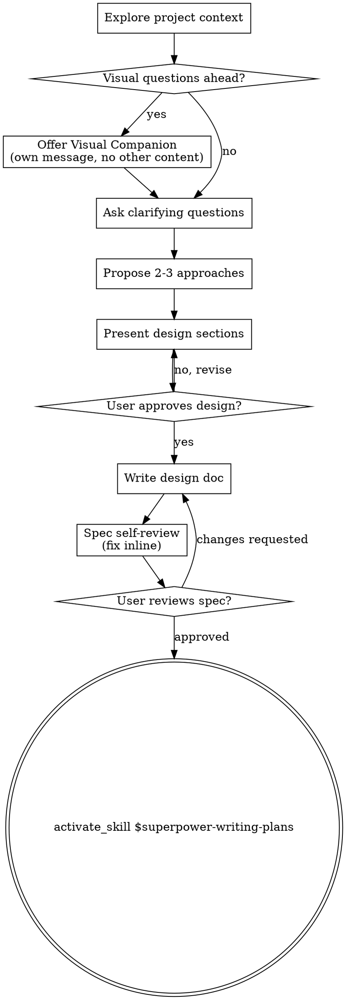

# Brainstorming Ideas Into Designs

> Adapted from Claude Code superpowers v5.0.7 for Gemini CLI

Help turn ideas into fully formed designs and specs through natural collaborative dialogue.

Start by understanding the current project context, then ask questions one at a time to refine the idea. Once you understand what you're building, present the design and get user approval.

<HARD-GATE>
Do NOT invoke any implementation skill, write any code, scaffold any project, or take any implementation action until you have presented a design and the user has approved it. This applies to EVERY project regardless of perceived simplicity.
</HARD-GATE>

## Anti-Pattern: "This Is Too Simple To Need A Design"

Every project goes through this process. A todo list, a single-function utility, a config change — all of them. "Simple" projects are where unexamined assumptions cause the most wasted work. The design can be short (a few sentences for truly simple projects), but you MUST present it and get approval.

## Checklist

You MUST track each of these items and complete them in order:

```yaml
# Brainstorming Progress Tracker
brainstorming_progress:
  - step: 1
    name: "Explore project context"
    description: "Check files, docs, recent commits"
    status: pending  # pending | in_progress | done
  - step: 2
    name: "Offer visual companion"
    description: "If topic will involve visual questions — own message, not combined with questions"
    status: pending
  - step: 3
    name: "Ask clarifying questions"
    description: "One at a time, understand purpose/constraints/success criteria"
    status: pending
  - step: 4
    name: "Propose 2-3 approaches"
    description: "With trade-offs and your recommendation"
    status: pending
  - step: 5
    name: "Present design"
    description: "In sections scaled to complexity, get user approval after each section"
    status: pending
  - step: 6
    name: "Write design doc"
    description: "Save to docs/superpowers/specs/YYYY-MM-DD-<topic>-design.md and commit"
    status: pending
  - step: 7
    name: "Spec self-review"
    description: "Quick inline check for placeholders, contradictions, ambiguity, scope"
    status: pending
  - step: 8
    name: "User reviews written spec"
    description: "Ask user to review the spec file before proceeding"
    status: pending
  - step: 9
    name: "Transition to implementation"
    description: "Invoke $superpower-writing-plans to create implementation plan"
    status: pending
```

## Process Flow



**The terminal state is activating $superpower-writing-plans.** Do NOT invoke $superpower-frontend-design, $superpower-mcp-builder, or any other implementation skill. The ONLY skill you activate after brainstorming is $superpower-writing-plans.

## The Process

**Understanding the idea:**

- Check out the current project state first using `run_shell_command` to inspect files, docs, recent commits (e.g., `git log --oneline -10`, `ls`, `find . -name "*.md" -maxdepth 2`)
- Use `read_file` to examine key files identified during exploration
- Before asking detailed questions, assess scope: if the request describes multiple independent subsystems (e.g., "build a platform with chat, file storage, billing, and analytics"), flag this immediately. Don't spend questions refining details of a project that needs to be decomposed first.
- If the project is too large for a single spec, help the user decompose into sub-projects: what are the independent pieces, how do they relate, what order should they be built? Then brainstorm the first sub-project through the normal design flow. Each sub-project gets its own spec → plan → implementation cycle.
- For appropriately-scoped projects, ask questions one at a time to refine the idea
- Prefer multiple choice questions when possible, but open-ended is fine too
- Only one question per message - if a topic needs more exploration, break it into multiple questions
- Focus on understanding: purpose, constraints, success criteria

**Exploring approaches:**

- Propose 2-3 different approaches with trade-offs
- Present options conversationally with your recommendation and reasoning
- Lead with your recommended option and explain why

**Presenting the design:**

- Once you believe you understand what you're building, present the design
- Scale each section to its complexity: a few sentences if straightforward, up to 200-300 words if nuanced
- Ask after each section whether it looks right so far
- Cover: architecture, components, data flow, error handling, testing
- Be ready to go back and clarify if something doesn't make sense

**Design for isolation and clarity:**

- Break the system into smaller units that each have one clear purpose, communicate through well-defined interfaces, and can be understood and tested independently
- For each unit, you should be able to answer: what does it do, how do you use it, and what does it depend on?
- Can someone understand what a unit does without reading its internals? Can you change the internals without breaking consumers? If not, the boundaries need work.
- Smaller, well-bounded units are also easier for you to work with — you reason better about code you can hold in context at once, and your edits are more reliable when files are focused. When a file grows large, that's often a signal that it's doing too much.

**Working in existing codebases:**

- Explore the current structure before proposing changes. Follow existing patterns.
- Where existing code has problems that affect the work (e.g., a file that's grown too large, unclear boundaries, tangled responsibilities), include targeted improvements as part of the design — the way a good developer improves code they're working in.
- Don't propose unrelated refactoring. Stay focused on what serves the current goal.

## After the Design

**Documentation:**

- Write the validated design (spec) using `write_file` to `docs/superpowers/specs/YYYY-MM-DD-<topic>-design.md`
  - (User preferences for spec location override this default)
- Use $superpower-elements-of-style writing-clearly-and-concisely skill if available
- Commit the design document to git using `run_shell_command` with `git add` and `git commit`

**Spec Self-Review:**

After writing the spec document, perform a sequential read-only analysis pass — review the spec with fresh eyes without making changes yet, identify all issues, then fix them in a single editing pass:

1. **Placeholder scan:** Any "TBD", "TODO", incomplete sections, or vague requirements? Fix them.
2. **Internal consistency:** Do any sections contradict each other? Does the architecture match the feature descriptions?
3. **Scope check:** Is this focused enough for a single implementation plan, or does it need decomposition?
4. **Ambiguity check:** Could any requirement be interpreted two different ways? If so, pick one and make it explicit.

Fix any issues inline using `edit_file`. No need to re-review — just fix and move on.

**Spec Document Review (inline):**

After writing and self-reviewing the spec, perform a final verification pass:

| Category | What to Look For |
|----------|------------------|
| Completeness | TODOs, placeholders, "TBD", incomplete sections |
| Consistency | Internal contradictions, conflicting requirements |
| Clarity | Requirements ambiguous enough to cause someone to build the wrong thing |
| Scope | Focused enough for a single plan — not covering multiple independent subsystems |
| YAGNI | Unrequested features, over-engineering |

**Calibration:** Only flag issues that would cause real problems during implementation planning. A missing section, a contradiction, or a requirement so ambiguous it could be interpreted two different ways — those are issues. Minor wording improvements, stylistic preferences, and "sections less detailed than others" are not.

Approve unless there are serious gaps that would lead to a flawed plan.

**Review Output Format:**

```markdown
## Spec Review

**Status:** Approved | Issues Found

**Issues (if any):**
- [Section X]: [specific issue] - [why it matters for planning]

**Recommendations (advisory, do not block approval):**
- [suggestions for improvement]
```

**User Review Gate:**

After the spec review loop passes, ask the user to review the written spec before proceeding:

> "Spec written and committed to `<path>`. Please review it and let me know if you want to make any changes before we start writing out the implementation plan."

Wait for the user's response. If they request changes, make them and re-run the spec review loop. Only proceed once the user approves.

**Implementation:**

- Activate the $superpower-writing-plans skill to create a detailed implementation plan
- Do NOT activate any other skill. $superpower-writing-plans is the next step.

## Key Principles

- **One question at a time** - Don't overwhelm with multiple questions
- **Multiple choice preferred** - Easier to answer than open-ended when possible
- **YAGNI ruthlessly** - Remove unnecessary features from all designs
- **Explore alternatives** - Always propose 2-3 approaches before settling
- **Incremental validation** - Present design, get approval before moving on
- **Be flexible** - Go back and clarify when something doesn't make sense

## Anti-Patterns Table

| Anti-Pattern | Why It's Harmful | What to Do Instead |
|---|---|---|
| Skipping design for "simple" tasks | Unexamined assumptions cause wasted work | Always present a design, even if short |
| Multiple questions per message | Overwhelms user, gets unfocused answers | One question at a time |
| Jumping to implementation | Builds wrong thing, costly rework | Complete full checklist first |
| Not exploring alternatives | Misses better approaches | Always propose 2-3 options |
| Over-designing simple tasks | Wastes time, over-engineering | Scale design to complexity |
| Proposing unrelated refactoring | Scope creep, loses focus | Stay focused on current goal |
| Combining visual companion offer with questions | User misses the offer or context | Visual companion offer is its own message |
| Not decomposing large projects | Single spec too broad to plan | Break into sub-projects first |

## Visual Companion

A browser-based companion for showing mockups, diagrams, and visual options during brainstorming. Available as a tool — not a mode. Accepting the companion means it's available for questions that benefit from visual treatment; it does NOT mean every question goes through the browser.

**Offering the companion:** When you anticipate that upcoming questions will involve visual content (mockups, layouts, diagrams), offer it once for consent:

> "Some of what we're working on might be easier to explain if I can show it to you in a web browser. I can put together mockups, diagrams, comparisons, and other visuals as we go. This feature is still new and can be token-intensive. Want to try it? (Requires opening a local URL)"

**This offer MUST be its own message.** Do not combine it with clarifying questions, context summaries, or any other content. The message should contain ONLY the offer above and nothing else. Wait for the user's response before continuing. If they decline, proceed with text-only brainstorming.

**Per-question decision:** Even after the user accepts, decide FOR EACH QUESTION whether to use the browser or the terminal. The test: **would the user understand this better by seeing it than reading it?**

- **Use the browser** for content that IS visual — mockups, wireframes, layout comparisons, architecture diagrams, side-by-side visual designs
- **Use the terminal** for content that is text — requirements questions, conceptual choices, tradeoff lists, A/B/C/D text options, scope decisions

A question about a UI topic is not automatically a visual question. "What does personality mean in this context?" is a conceptual question — use the terminal. "Which wizard layout works better?" is a visual question — use the browser.

### Visual Companion: When to Use

Decide per-question, not per-session. The test: **would the user understand this better by seeing it than reading it?**

**Use the browser** when the content itself is visual:

- **UI mockups** — wireframes, layouts, navigation structures, component designs
- **Architecture diagrams** — system components, data flow, relationship maps
- **Side-by-side visual comparisons** — comparing two layouts, two color schemes, two design directions
- **Design polish** — when the question is about look and feel, spacing, visual hierarchy
- **Spatial relationships** — state machines, flowcharts, entity relationships rendered as diagrams

**Use the terminal** when the content is text or tabular:

- **Requirements and scope questions** — "what does X mean?", "which features are in scope?"
- **Conceptual A/B/C choices** — picking between approaches described in words
- **Tradeoff lists** — pros/cons, comparison tables
- **Technical decisions** — API design, data modeling, architectural approach selection
- **Clarifying questions** — anything where the answer is words, not a visual preference

A question *about* a UI topic is not automatically a visual question. "What kind of wizard do you want?" is conceptual — use the terminal. "Which of these wizard layouts feels right?" is visual — use the browser.

### Visual Companion: How It Works

The server watches a directory for HTML files and serves the newest one to the browser. You write HTML content to `screen_dir`, the user sees it in their browser and can click to select options. Selections are recorded to `state_dir/events` that you read on your next turn.

**Content fragments vs full documents:** If your HTML file starts with `<!DOCTYPE` or `<html`, the server serves it as-is (just injects the helper script). Otherwise, the server automatically wraps your content in the frame template — adding the header, CSS theme, selection indicator, and all interactive infrastructure. **Write content fragments by default.** Only write full documents when you need complete control over the page.

### Visual Companion: Starting a Session

```bash
# Start server with persistence (mockups saved to project)
# For Gemini CLI: use --foreground and set is_background: true on your shell tool call
scripts/start-server.sh --project-dir /path/to/project --foreground
```

Returns JSON:
```json
{"type":"server-started","port":52341,"url":"http://localhost:52341",
 "screen_dir":"/path/to/project/.superpowers/brainstorm/12345-1706000000/content",
 "state_dir":"/path/to/project/.superpowers/brainstorm/12345-1706000000/state"}
```

Save `screen_dir` and `state_dir` from the response. Tell user to open the URL.

**Finding connection info:** The server writes its startup JSON to `$STATE_DIR/server-info`. If you launched the server in the background and didn't capture stdout, use `read_file` on that file to get the URL and port. When using `--project-dir`, check `<project>/.superpowers/brainstorm/` for the session directory.

**Note:** Pass the project root as `--project-dir` so mockups persist in `.superpowers/brainstorm/` and survive server restarts. Without it, files go to `/tmp` and get cleaned up. Remind the user to add `.superpowers/` to `.gitignore` if it's not already there.

### Visual Companion: The Loop

1. **Check server is alive**, then **write HTML** to a new file in `screen_dir`:
   - Before each write, check that `$STATE_DIR/server-info` exists using `run_shell_command` with `test -f`. If it doesn't (or `$STATE_DIR/server-stopped` exists), the server has shut down — restart it with `start-server.sh` before continuing. The server auto-exits after 30 minutes of inactivity.
   - Use semantic filenames: `platform.html`, `visual-style.html`, `layout.html`
   - **Never reuse filenames** — each screen gets a fresh file
   - Use `write_file` — **never use cat/heredoc** (dumps noise into terminal)
   - Server automatically serves the newest file

2. **Tell user what to expect and end your turn:**
   - Remind them of the URL (every step, not just first)
   - Give a brief text summary of what's on screen (e.g., "Showing 3 layout options for the homepage")
   - Ask them to respond in the terminal: "Take a look and let me know what you think. Click to select an option if you'd like."

3. **On your next turn** — after the user responds in the terminal:
   - Use `read_file` on `$STATE_DIR/events` if it exists — this contains the user's browser interactions (clicks, selections) as JSON lines
   - Merge with the user's terminal text to get the full picture
   - The terminal message is the primary feedback; `state_dir/events` provides structured interaction data

4. **Iterate or advance** — if feedback changes current screen, write a new file (e.g., `layout-v2.html`). Only move to the next question when the current step is validated.

5. **Unload when returning to terminal** — when the next step doesn't need the browser (e.g., a clarifying question, a tradeoff discussion), push a waiting screen to clear the stale content:

   ```html
   <!-- filename: waiting.html (or waiting-2.html, etc.) -->
   <div style="display:flex;align-items:center;justify-content:center;min-height:60vh">
     <p class="subtitle">Continuing in terminal...</p>
   </div>
   ```

   This prevents the user from staring at a resolved choice while the conversation has moved on. When the next visual question comes up, push a new content file as usual.

6. Repeat until done.

### Visual Companion: Writing Content Fragments

Write just the content that goes inside the page. The server wraps it in the frame template automatically (header, theme CSS, selection indicator, and all interactive infrastructure).

**Minimal example:**

```html
<h2>Which layout works better?</h2>
<p class="subtitle">Consider readability and visual hierarchy</p>

<div class="options">
  <div class="option" data-choice="a" onclick="toggleSelect(this)">
    <div class="letter">A</div>
    <div class="content">
      <h3>Single Column</h3>
      <p>Clean, focused reading experience</p>
    </div>
  </div>
  <div class="option" data-choice="b" onclick="toggleSelect(this)">
    <div class="letter">B</div>
    <div class="content">
      <h3>Two Column</h3>
      <p>Sidebar navigation with main content</p>
    </div>
  </div>
</div>
```

That's it. No `<html>`, no CSS, no `<script>` tags needed. The server provides all of that.

### Visual Companion: CSS Classes Available

The frame template provides these CSS classes for your content:

**Options (A/B/C choices):**
```html
<div class="options">
  <div class="option" data-choice="a" onclick="toggleSelect(this)">
    <div class="letter">A</div>
    <div class="content">
      <h3>Title</h3>
      <p>Description</p>
    </div>
  </div>
</div>
```

**Multi-select:** Add `data-multiselect` to the container to let users select multiple options:
```html
<div class="options" data-multiselect>
  <!-- same option markup — users can select/deselect multiple -->
</div>
```

**Cards (visual designs):**
```html
<div class="cards">
  <div class="card" data-choice="design1" onclick="toggleSelect(this)">
    <div class="card-image"><!-- mockup content --></div>
    <div class="card-body">
      <h3>Name</h3>
      <p>Description</p>
    </div>
  </div>
</div>
```

**Mockup container:**
```html
<div class="mockup">
  <div class="mockup-header">Preview: Dashboard Layout</div>
  <div class="mockup-body"><!-- your mockup HTML --></div>
</div>
```

**Split view (side-by-side):**
```html
<div class="split">
  <div class="mockup"><!-- left --></div>
  <div class="mockup"><!-- right --></div>
</div>
```

**Pros/Cons:**
```html
<div class="pros-cons">
  <div class="pros"><h4>Pros</h4><ul><li>Benefit</li></ul></div>
  <div class="cons"><h4>Cons</h4><ul><li>Drawback</li></ul></div>
</div>
```

**Mock elements (wireframe building blocks):**
```html
<div class="mock-nav">Logo | Home | About | Contact</div>
<div style="display: flex;">
  <div class="mock-sidebar">Navigation</div>
  <div class="mock-content">Main content area</div>
</div>
<button class="mock-button">Action Button</button>
<input class="mock-input" placeholder="Input field">
<div class="placeholder">Placeholder area</div>
```

**Typography and sections:**
- `h2` — page title
- `h3` — section heading
- `.subtitle` — secondary text below title
- `.section` — content block with bottom margin
- `.label` — small uppercase label text

### Visual Companion: Browser Events Format

When the user clicks options in the browser, their interactions are recorded to `$STATE_DIR/events` (one JSON object per line). The file is cleared automatically when you push a new screen.

```jsonl
{"type":"click","choice":"a","text":"Option A - Simple Layout","timestamp":1706000101}
{"type":"click","choice":"c","text":"Option C - Complex Grid","timestamp":1706000108}
{"type":"click","choice":"b","text":"Option B - Hybrid","timestamp":1706000115}
```

The full event stream shows the user's exploration path — they may click multiple options before settling. The last `choice` event is typically the final selection, but the pattern of clicks can reveal hesitation or preferences worth asking about.

If `$STATE_DIR/events` doesn't exist, the user didn't interact with the browser — use only their terminal text.

### Visual Companion: Design Tips

- **Scale fidelity to the question** — wireframes for layout, polish for polish questions
- **Explain the question on each page** — "Which layout feels more professional?" not just "Pick one"
- **Iterate before advancing** — if feedback changes current screen, write a new version
- **2-4 options max** per screen
- **Use real content when it matters** — for a photography portfolio, use actual images (Unsplash). Placeholder content obscures design issues.
- **Keep mockups simple** — focus on layout and structure, not pixel-perfect design

### Visual Companion: File Naming

- Use semantic names: `platform.html`, `visual-style.html`, `layout.html`
- Never reuse filenames — each screen must be a new file
- For iterations: append version suffix like `layout-v2.html`, `layout-v3.html`
- Server serves newest file by modification time

### Visual Companion: Cleaning Up

```bash
# Via run_shell_command:
scripts/stop-server.sh $SESSION_DIR
```

If the session used `--project-dir`, mockup files persist in `.superpowers/brainstorm/` for later reference. Only `/tmp` sessions get deleted on stop.

## Output Contract

Return one approved design package:

- `Summary:` the problem and intended outcome
- `Chosen approach:` recommendation and why it won
- `Open risks:` anything the user accepted or deferred
- `Next skill:` `$superpower-writing-plans`

## Gemini CLI Tool Mapping Reference

| CC Tool | Gemini CLI Equivalent |
|---|---|
| Task tool / Agent tool | Inline sequential execution |
| Skill tool | activate_skill |
| Bash | run_shell_command |
| AskUserQuestion | ask_user |
| Read | read_file |
| Write | write_file |
| Edit | edit_file |
| Grep / Glob | run_shell_command with `grep` / `find` |
| TodoWrite | Inline YAML tracking blocks (see Checklist section) |
| EnterPlanMode / ExitPlanMode | Sequential read-only analysis pass (no tool calls) |
